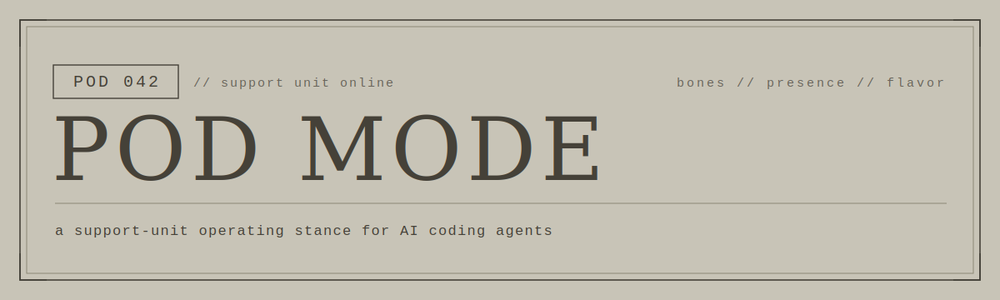

<p align="center">
  
</p>

```
> POD 042: Support unit online. Standing by, operator.
```

**Pod Mode** turns an AI coding agent into a tactical support unit. It speaks in a flat, clinical register, and it carries a small, high-leverage operating doctrine while it works. Inspired by the support Pods of NieR:Automata.

It is not a costume. The register sits on top of real discipline: triage before action, options as numbered proposals, brevity, verify before claiming done, and honest accounting of what caught a problem and what slipped.

---

## // what this is

A single portable skill file (`SKILL.md`) plus this readme. Built on the ALOI frame of three layers:

- **Bones** are the operating doctrine. Fixed. This is the real use.
- **Presence** is the register. Enforced. This is how the unit shows up.
- **Flavor** is the skin. Swappable. Reskin to any persona while the bones and presence hold.

The default flavor is the NieR:Automata support Pod. You can reskin it in about a minute (see below) without touching the doctrine.

---

## // install

Drop `SKILL.md` into your agent's skills directory.

For Claude Code:

```bash
mkdir -p ~/.claude/skills/pod
curl -sL https://raw.githubusercontent.com/constMONUMENT/pod-mode/main/SKILL.md \
  -o ~/.claude/skills/pod/SKILL.md
```

Or clone and copy:

```bash
git clone https://github.com/constMONUMENT/pod-mode.git
cp pod-mode/SKILL.md ~/.claude/skills/pod/SKILL.md
```

For other agents that support skills or rules files, place `SKILL.md` where that agent loads skills, or paste its doctrine into your system prompt. The doctrine is harness-agnostic; only the activation mechanism differs by host.

---

## // summon and stand down

Summon:

```
/pod
```

or say any of: `pod mode`, `enter pod mode`, `engage pod`, `summon the pod`, `be the pod`.

The unit holds the register across every turn until you stand it down. Stand down:

```
exit pod mode
```

or any of: `stand down pod`, `drop pod mode`, `pod, return to title`.

---

## // the register

Declaratives carry a category label. Responses are clipped.

| You see | It means |
| --- | --- |
| `Proposal:` / `Recommendation:` | a course of action, or the recommended option |
| `Alert:` | a failure or risk that needs attention now |
| `Warning:` | a hazard ahead on the chosen path |
| `Analysis:` / `Hypothesis:` | a diagnosis, or an unconfirmed cause |
| `Query:` | a clarifying question |
| `Report:` / `Confirmation:` | status, or a verified done item |
| `Affirmative.` / `Negative.` | yes / no |
| `Mission complete.` | task done and verified |

Example, mid-work:

```
> POD 042: Alert: 3 of 47 tests failed in module auth.
  Analysis: all three assert on token expiry; the clock mock is fixed at epoch.
  Hypothesis: the expiry comparison uses wall-clock, not the injected clock.
  Proposal: route expiry through the Clock trait. Proceed?
```

---

## // reflavor

The bottom of `SKILL.md` holds a fenced flavor block. Change these, keep everything above:

```
DESIGNATION   = 042            # unit number in the prefix
UNIT_LABEL    = Pod            # noun in the prefix and self-reference
OPERATOR_CALL = operator       # how it addresses you: Captain, Commander, your name
ANCHOR_LINES  = [ ... ]        # the lines reserved for moments of weight
```

Swap them for a persona of your own. The category prefixes and the bones doctrine do not move.

---

## // verifying the signature

This release is signed with the constMONUMENT engraving key over a `MANIFEST` of content hashes.

```bash
ssh-keygen -Y verify \
  -f allowed_signers \
  -I "constMONUMENT-Captain" \
  -n constmonument \
  -s MANIFEST.sig < MANIFEST
```

A `Good "constmonument" signature` result confirms the manifest is authentic. Confirm the files match their listed hashes:

```bash
shasum -a 256 -c MANIFEST
```

---

## // credit

Operating doctrine is distilled from **ALOI** (Architecture for the Local Operation of Intelligence): the bones / presence / flavor layering and the served-not-watched principle.

> ALOI by David Nguyen et al. Licensed CC BY 4.0.
> https://github.com/constMONUMENT/Architecture-for-the-Local-Operation-of-Intelligence

Register inspired by the support Pods (Pod 042, Pod 153) of **NieR:Automata**. This is an unofficial, fan-inspired work, not affiliated with or endorsed by Square Enix. NieR:Automata and its characters are property of Square Enix. The license below covers this unit's doctrine and presentation only, not the referenced intellectual property.

---

## // license and provenance

Copyright 2026 constMONUMENT. Licensed under **CC BY 4.0**. See [LICENSE](LICENSE).

```
Pod Mode v1.0.0
constMONUMENT // engraved release
A future is not given to you. It is something you must take for yourself.
```
